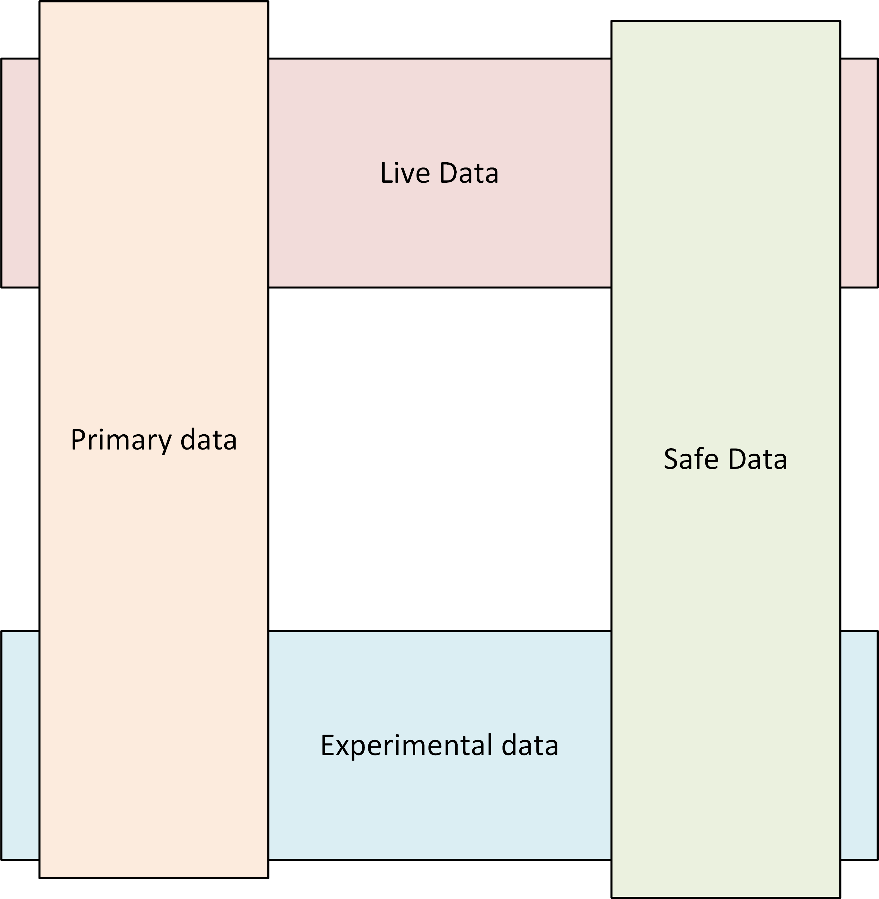

# Data Classification for Environments

**produced by Dave Lusty**

## Introduction

This document aims to clear up some misconceptions around data classification and staging environments. The terms "dev", "test" and "production" are ubiquitous yet often misunderstood for legacy reasons. As we move into a more agile and cloud centric world it becomes more important to fully understand what data is where and why.

## Production Data

The term production data is often used to refer to the actual business data. As such, the term production can be misleading since it implies that data is in the production environment. There are various considerations which can make this clear, with new classifications laid out below.

### Is this the primary copy of the data?

In all computing, there are systems of record. These are the place where data is created and edited. Sometimes data is copied to multiple systems and worked on in both locations. In such instances both can be considered systems of record, and therefore the data within them is what I will refer to as **"primary data"**. This means that the data is the source data and is unadulterated.

### Is the data on a production system?

This question is important. Primary data may be copied to other production systems. The data may still be unadulterated primary data, or it may be modified in some way. Because it is running on a production system (for example a data warehouse, or data lake) it must have suitable governance to ensure it is not accidentally corrupted in any way. I will refer to this data as **"live data"** since it may no longer be primary if the data has been modified, but is still sufficiently important for tight controls. 

Primary data may also be copied to systems which are not in production, in order to allow it to be used in a less safe way. This does not alter the data classification in and of itself, and so any data governance controls in place in production such as security access or privacy controls must still be used. The difference here is that if the data is in any way corrupted the production systems of the business will not be interrupted in any way. This allows users to try things out on the data without consequences, and data can be copied from a production source again to refresh the data. I will refer to this data as **"experimental data"**. Note that this is distinct from "test data" which is discussed later in the document.

### Has the data been modified for privacy or compliance reasons?

Primary data may be copied and modified to remove specific information, for example personally identifiable information (PII) or credit card information (for regulatory reasons). The destination of this copy does not affect the classification of the data, it may be a development location or a production location. The act of cleansing the data. In all instances, the data classification will change from primary data with very strict controls around use, security, movement and processing to what I will call **"safe data"** which might have less stringent controls for the purposes of data manipulation. If the safe data remains in a production environment, then the production governance will still apply to ensure that the safe data does not become corrupted or unusable, but this is distinct from the data security and compliance controls.

## Test Data

### Structured Testing

The pass/fail nature of structured testing means that you must have an assertion and a known answer. This is not possible to do with fresh data from live systems in any controlled or repeatable manner. For this reason **"Test Data"** must be user generated based on those assertions and answers. If you are testing an aggregation then you must generate known data, manually compute the aggregation and then set that as the answer to the test. This way the test is repeatable and has a different path than the thing you are testing.

### Accuracy Testing

Machine learning tests are very different to structured testing and instead often incorporate some manual statistical analysis. In this instance it is likely that your "test data" is just part of your data set and so a different data set may not be required, or may just be a partial copy to a new location.

## Data Classifications

### Primary Data

<table>
<tr>
<td>Operational Governance</td>
<td bgcolor="#ff3333">yes</td>
</tr>
<tr>
<td>Regulatory Governance</td>
<td bgcolor="#ff3333">yes</td>
</tr>
</table>

### Live Data

<table>
<tr>
<td>Operational Governance</td>
<td bgcolor="#ff3333">yes</td>
</tr>
<tr>
<td>Regulatory Governance</td>
<td bgcolor="#33ccff">N/A</td>
</tr>
</table>

### Experimental Data

<table>
<tr>
<td>Operational Governance</td>
<td bgcolor="#33ff33">No</td>
</tr>
<tr>
<td>Regulatory Governance</td>
<td bgcolor="#33ccff">N/A</td>
</tr>
</table>

### Safe Data

<table>
<tr>
<td>Operational Governance</td>
<td bgcolor="#33ccff">N/A</td>
</tr>
<tr>
<td>Regulatory Governance</td>
<td bgcolor="#ff3333">yes</td>
</tr>
</table>

### Test Data

<table>
<tr>
<td>Operational Governance</td>
<td bgcolor="#33ccff">N/A</td>
</tr>
<tr>
<td>Regulatory Governance</td>
<td bgcolor="#33ccff">N/A</td>
</tr>
</table>