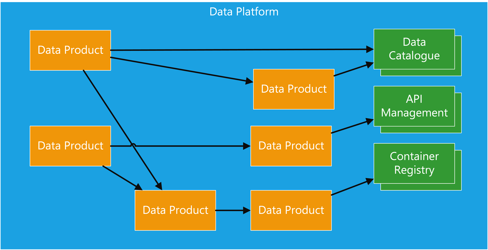

# Data Platforms

**produced by Dave Lusty**

## Introduction

This document aims to set out what a data platform is and what is necessary to make it workable. I have tried to minimise complexity here for the sake of clarity, and have tried to keep all terms used as simple as possible.

## Data Platform

At it's simplest, a data platform consists of some kind of catalog to find and describe data, and a bunch of data sets. I have chosen to avoid going into technical architecture at this stage, because it distracts from the real challenge of a data platform which is how it fits within the organisation, who manages and maintains it, and who builds it? These questions must be answered before you can decide any technical aspects of the design, and they will heavily influence that design. Please bear in mind that this document describes a cloud native data environment. If you are building a legacy architecture where you deploy the platform and then fill it with data, this document is not for you. This architecture is cloud native from the ground up, meaning that components are deployed as needed and the solution is modular with individually scaled parts.

<table>
<tr>
<td width="25%">&nbsp;</td>
<td width="50%"></td>
<td width="25%">&nbsp;</td>
</tr>
</table>

## Data Sets

Data sets are the basic component of the platform. Each data set is a self contained and self describing product that must form a contract with the outside world and must be discoverable. In an ideal world, a data set should not have any tightly coupled dependencies and while it may depend on other data sets, that relationship should be loosely coupled such that, for instance, late processing of one does not affect the other.

<table>
<tr>
<td width="25%">&nbsp;</td>
<td width="50%"></td>
<td width="25%">&nbsp;</td>
</tr>
</table>

### The Team

Before creating a data set you need to determine who owns that data set from a product point of view. Traditionally, once data was removed from a system of record the ownership transferred to the "data team" whatever form that took. A different way to look at this is to imagine that the owner of the source system is it's own entity and is responsible for sharing that data out with the world. This has many benefits which are rooted in the fact that the team who run the source system already understand the data, the infrastructure, and the usage as well as any number of important aspects such as compliance. Generally the data team will not be aware of these details and so have to learn them during the project, slowing down progress. This is not to say that the team responsible for the SAP ERP system must also be responsible for building the data pipelines to get it into a data lake, but they should certainly play a core role in the team that does so. This draws from the idea of DevOps, where the team is made up of cross discipline members who, together, have the ability to create and run the product. Building such a team can lead to great efficiencies due to familiarity with the domain. 
The team will decide how to present their data set out to the world. This may seem obvious, but it is often ignored in more traditional "layered" approaches where raw extracts become one data set and a cleansed version of that same data become another. With a data centric approach it would be quite normal to only present the cleaned up data to the outside world, even if within the data set infrastructure there exists a copy of the raw extracted data (and usually there would, to allow rebuilding and refactoring).

> **Decision**
>
> Within your architecture and organisation you should decide who will be the "publisher" of data sets. Will each team be responsible for presenting their own data (possibly with the help of the data team), or will you centralise that task and have a data team extract data from those systems? In both cases you can still segregate by data set.

### Data

#### Sources

Each data set must comprise of zero or more upstream sources for its data. We include zero here because often a lake will include random and manufactured data for testing purposes which will not have a source. In these instances the architecture may look very different for the data set when compared to the standard ELT model.