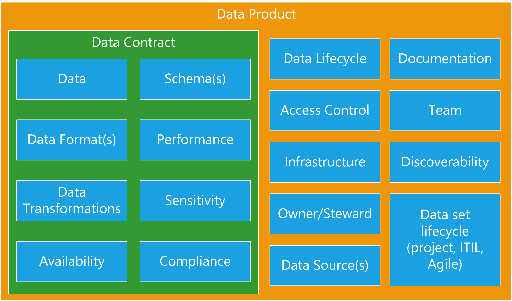

# Data Platforms

**produced by Dave Lusty**

## Introduction

This document aims to set out what a data platform is and what is necessary to make it workable. I have tried to minimise complexity here for the sake of clarity, and have tried to keep all terms used as simple as possible. The concepts here align well with the distributed data mesh concepts published elsewhere, the aim here is to explain how you might go about using those concepts in a real world platform. It's important to understand that most of the ideas here require operational change in how the data team works on a day to day basis, and how it interacts with the wider business.

## Data Platform

At it's simplest, a data platform consists of some kind of catalog to find and describe data, and a bunch of data products which will each house some kind of solution, be it a data set or a streaming data analytics solution. Each one is an encapsulated system with known outputs and inputs. I have chosen to avoid going into technical architecture at this stage, because it distracts from the real challenge of a data platform which is how it fits within the organisation, who manages and maintains it, and who builds it? These questions must be answered before you can decide any technical aspects of the design, and they will heavily influence that design. Please bear in mind that this document describes a "cloud" data environment. If you are building a legacy architecture where you deploy the platform and then fill it with data, this document is not for you. This architecture is cloud native from the ground up, meaning that components are deployed as needed and the solution is modular with individually scaled parts. That is not to say this must be public cloud. A data product can, and often will be implemented using traditional on-premises data products. The idea of cloud architecture is related to the way we implement and scale a solution in a more modular way.

<table>
<tr>
<td width="25%">&nbsp;</td>
<td width="50%"></td>
<td width="25%">&nbsp;</td>
</tr>
</table>

## Data Products

Data products are the basic component of the platform. Each data product is a self contained and self describing product that must form a contract with the outside world and must be discoverable. In an ideal world, a data product should not have any tightly coupled dependencies and while it may depend on other data products, that relationship should be loosely coupled such that, for instance, late processing of one does not affect the other. If tightly coupling is required, for instance to meet processing time requirements, then it is often better to encapsulate the whole process inside a single product. While this might mean duplication of effort in some cases, it is ultimately more manageable in the long term.

<table>
<tr>
<td width="25%">&nbsp;</td>
<td width="50%"></td>
<td width="25%">&nbsp;</td>
</tr>
</table>

### The Product

We use the word product intentionally here since it's widely used within the technical community and specifically in DevOps to describe an output which is being built by a team. The product will have features, and it will have ownership to guide its development. There will be a feedback loop in place to allow its "customers" to ask for improvements, changes, or new features. Calling it a product instils the idea of a vendor-customer relationship which is useful to understand why the product exists, as well as to understand who is paying for it, either directly or indirectly. If the customer asks for a new feature, the decision must be made as to whether that feature should be included in the current product, or if it's sufficiently different as to require a new product.
In the same way as any other product, data products might be stand alone, or they may consist of components. These components can be other products. For example, a code library developed purely to support the immediate product might just be a part of the project, while a code library that's used across the business would be a product itself, with its own owners, team, requirements etc. Each product will have a deployment cycle to bring it to production, and a clear location from which to consume it. In the case of a data set that might be a data warehouse, a code library used for data quality in multiple data products would use an object repository such as Azure Artifacts, and a machine learning model might be deployed to a container registry ready to be used by other projects.

<table>
<tr>
<td width="25%">&nbsp;</td>
<td width="50%"></td>
<td width="25%">&nbsp;</td>
</tr>
</table>

### The Team

Before creating a data product you need to determine who owns that data product from a "product" point of view. Traditionally, once data was removed from a system of record the ownership transferred to the "data team" whatever form that took. A different way to look at this is to imagine that the owner of the source system is it's own entity and is responsible for sharing that data out with the world. This has many benefits which are rooted in the fact that the team who run the source system already understand the data, the infrastructure, and the usage as well as any number of important aspects such as compliance. Generally the data team will not be aware of these details and so have to learn them during the project, slowing down progress. This is not to say that the team responsible for the SAP ERP system must also be responsible for building the data pipelines to get it into a data lake, but they should certainly play a core role in the team that does so. This draws from the idea of DevOps, where the team is made up of cross discipline members who, together, have the ability to create and run the product. Building such a team can lead to great efficiencies due to familiarity with the domain. 
The team will decide how to present their data product out to the world. This may seem obvious, but it is often ignored in more traditional "layered" approaches where raw extracts become one data product and a cleansed version of that same data become another. With a data centric approach it would be quite normal to only present the cleaned up data to the outside world, even if within the data product infrastructure there exists a copy of the raw extracted data (and usually there would, to allow rebuilding and refactoring).

> **Decision**
>
> Within your architecture and organisation you should decide who will be the "publisher" of data products. Will each team be responsible for presenting their own data (possibly with the help of the data team), or will you centralise that task and have a data team extract data from those systems? In both cases you can still segregate by data product. 

### Data

#### Sources

Each data product must comprise of zero or more upstream sources for its data. We include zero here because often a lake will include random and manufactured data for testing purposes which will not have a source. In these instances the architecture may look very different for the data product when compared to the standard ELT model.

## Examples

### Ingest Data

<table>
<tr>
<td width="25%">&nbsp;</td>
<td width="50%"></td>
<td width="25%">&nbsp;</td>
</tr>
</table>

### Event Data

<table>
<tr>
<td width="25%">&nbsp;</td>
<td width="50%"></td>
<td width="25%">&nbsp;</td>
</tr>
</table>

### External Data

<table>
<tr>
<td width="25%">&nbsp;</td>
<td width="50%"></td>
<td width="25%">&nbsp;</td>
</tr>
</table>

### Modelled Data and EDW

<table>
<tr>
<td width="25%">&nbsp;</td>
<td width="50%"></td>
<td width="25%">&nbsp;</td>
</tr>
</table>