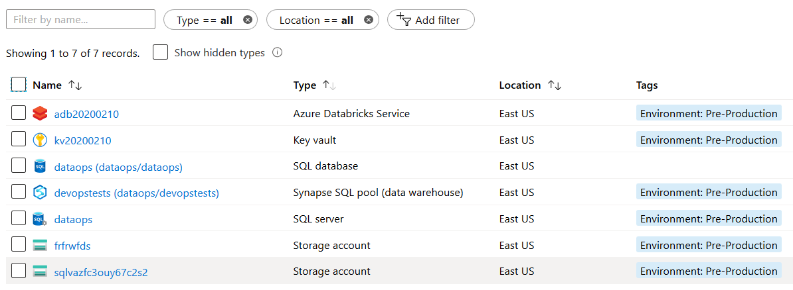
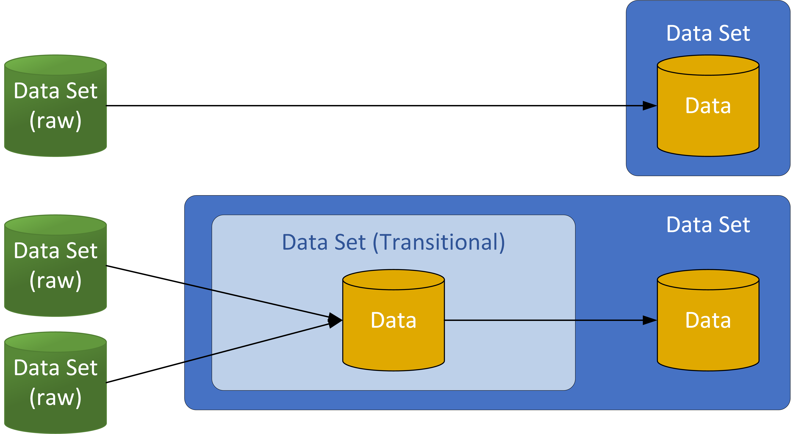
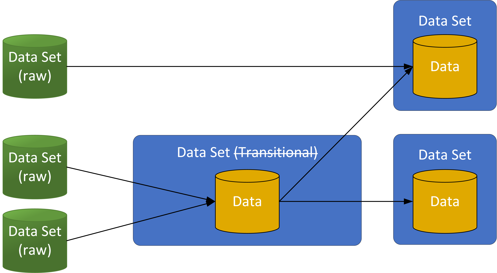
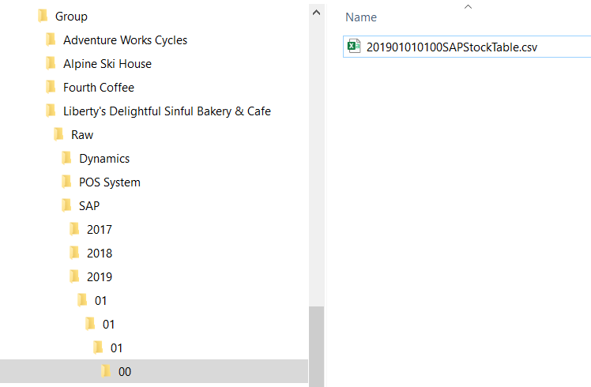

# DatalakeDocs

Data lake documentation and opinions.
For the design workshop questionnaire, [go here](questionnaire.md)

## Subscriptions

## Storage Accounts

The first question to address in a data lake is how many storage accounts you'll need, and what type of accounts to use.

### Account Types

On Azure, you have four options for your data lake storage:

* Bring your own
* Blob Storage
* Azure Data Lake Store Gen 2
* Azure Data Lake Store Gen 1

The **bring your own** option could involve connecting to existing storage elsewhere, or it could involve deploying an appliance or virtual machine cluster on to Azure infrastructure. This type of storage allows for maximum flexibility but at the same time will raise costs and management/maintenance and so is the least preferred option. Unless you have a good reason to do this, don't do it.

**Azure Data Lake Storage Gen 1** is an HDFS implementation managed by Microsoft, and uses special hardware within the Azure data centres. While this option will continue to work well in situations where you need HDFS for some reason. Cost and availability are two reasons you may want to try to use other services, since this is not globally in all data centres. This has also been superseded by ADLS Gen 2 which, although a completely different offering, is generally compatible in most of the same scenarios.

**Blob and ADLS Gen 2** use the same underlying services but have different costs and capabilities. The main difference is that of hierarchies, also referred to as folders. While blob storage offers virtual folders, these do not allow file operations against them. What this means in practice, is that on ADLSg2 renaming a folder will use a single file operation against the file system while on Blob the same action will use one operation for every file in the virtual folder. Since each operation takes several milliseconds, this can add up to a lot of time overall for large folders. Since that time means your expensive cluster will need to remain on it could be very expensive to use Blob in situations where you are processing data. For reference, many big data operations will write data to a temporary folder and rename it at the end, so this will happen in most scenarios where you're transforming data.

As a general rule, new raw data coming in should go to Blob Storage which will allow it to utilise storage tiering to reduce costs while also being performant enough for most use cases raw data will need.

Modified data will generally be stored on ADLS Gen 2 since hierarchies will ensure best performance while processing.

### Number of Accounts

As a general rule you'll start with two storage accounts. One Blob account for raw data sets and one ADLS Gen 2 for everything else. Start with this and add accounts as and when you can justify more. Reasons you may want more accounts are:

* Organisational separation
* Regional separation
* Security boundaries
* Performance
* System limitations

#### Organisational Separation

Where an organisation has separate business units it makes sense to use different accounts for these to enable M&A activity to proceed more easily should one BU need to move away from the others. This also gives clear ownership to data and allows different teams to own their own data.

#### Regional Separation

Where data is sourced from different regions it makes sense to land it locally in those regions in many scenarios. Once inside Azure, the networking uses a high speed network, and so processing may be able to leverage data from multiple locations.
Conversely, latency from distance could interfere with processing time and so data may need to be colocated in one region for performance purposes.

#### Security Boundaries

In most scenarios, storage accounts can be used to segregate for security purposes. For instance HR data and Sales data may have very different security requirements and so should be stored in different accounts for simplicity of permissions and access control.

#### Performance

In many scenarios, separating data to different storage accounts can improve performance due to throughput limitations as mentioned below.

#### System Limitations

The [Microsoft documentation](https://docs.microsoft.com/en-us/azure/storage/common/scalability-targets-standard-account) shows the limits of storage accounts. Important things to note are throughput (particularly egress speed), transactions and number of accounts. The limit on accounts in a region is the reason we don't simply create one account per data set, although this is a soft limit and may be raised.

### Storage Account Naming

This section is simple, but often misundertood. In traditional IT it was common to come up with a naming scheme. In the cloud this is not always possible, and storage accounts are one of those times. Storage accounts have a public endpoint and so use DNS globally unique names for access. As such you can not enforce a naming scheme for storage accounts. Let me say that again **you can not enforce a naming scheme for storage accounts**. The solution is to either use auto-generated names, random names, unique-string (in ARM templates) or some combination of those. This is not an issue if you use the wider Azure service effectively with resource group names (based on internal service identifiers usually), tags (you can add a description tag), and the various columns of information in the portal which already tell you it's a storage account. There is no benefit to including the Azure service type in your naming, since every single method of listing objects allows you to search, sort and view by service type. You can see the portal version of this below, showing type, region and environment tags alongside resource names. You can also see the powerful filtering system which would allow us to drill down into any of these attributes quickly to find the right resource.

## Structure

The first thing to understand about the structure of a data lake is what you'll be storing on it. That may seem obvious, but it's worth a scentence or two to level understanding. You're going to be storing data sets in your lake (this is hopefully obvious). A data set, from a governance perspective, is either finished and consumable or it's not. You may have transitional data and experimental data in your lake too. Transitional data does not form part of the structure of the lake, it forms part of the structure of a data set, and will usually be transient (i.e. it's removed when processing completes). Experimental data is used by data scientists and machine learning experts and will often have an ad-hoc structure created by the team using it. This does not form part of your structured lake, aside from the top level container provided to that team.

### Data sets

A data set must have an owner. This seems obvious since every other concept in IT includes an owner. Someone should be responsible for:

* Data life cycle management
* Compliance
* Availability
* Transformation of data
* Data delivery contract
* Access control

Data sets will be created from raw data and/or other data sets. Raw data should also be thought of as data sets, and include all of the ownership and management discussed above. Where data is transformed, but does not constitute a deliverable data set on its own (i.e. does not include a data delivery contract of its own) it should be considered a transitional data set which belongs within the data set consuming it.

This, in turn, enables us to pull the transitional data set out later and promote it to full data set if a second use case is found to consume it. This is analogous to the idea of silver or curated in other documentation, but it should be noted that this is not a function of the lake, or a layer on the lake but of a data set itself.

### Data Set Types

The below shows some descriptions of data often referred to as layers. While these concepts are very useful within the data set to describe the steps of processing to take incoming data (or other data sets) and create a data set, they offer little in terms of structuring a data lake. Where necessary, these should be encapsulated inside of a data set or treated as transitional data sets. In reality, many of these steps can be consolidated into a single pipeline and so will often not land as objects on the lake.

 * Raw
  * Incoming data
  * Original source data
  * Historical
  * Changed file format only
 * Cleansed
   * Tidy up data
   * Correct format
   * Standardising
 * Curated/Enriched
  * Merge data sets
  * Add columns
 * Modelled
  * Create tables
  * Build the model
  * Create Aggregates

### Containers, Folders, Virtual Folders and Hierarchies

As mentioned elsewhere, Blob does not actually support folders. It does support virtual folders, which look the same on the surface but don't offer the various benefits of a real folder from a filesystem operation perspective. Even virtual folders are useful to make your lake more accessible to humans, and so we would generally still use them. Containers can be thought of as a sort of super folder at the root level of your structure under the storage account. These can be used for organisational separation, dataset separation, access control, backup or tiering segregation and many other purposes.

 * Purpose (Raw, Refined etc.)
 * System/Origin
 * Organisation/Business Unit
 * Date
 * Sensor Name/ID

 

 When looking at all of these, ensure you take performance into account. Many small files are much slower to process than fewer large files, and therefore small files will cost more to process. File sizes of 250MiB to 1GiB should be the target. For this reason, it might be cheaper to process a month of data at a time, and re-process the entire month every day than to gather data in individual days throughout the month. Although the latter, using a YYYY/MM/DD folder structure, seems neater it will often cause performance issues if the daily data size is too small.

## Files

### Naming

File naming is important to make the lake somewhat human readable for scenarios such as data science. The below are some attributes that might be useful as part of a filename. The aim here is not to include all of them but to include just enough to describe the file in a useful way.

 * Date
 * Time
 * System
 * Table
 * Format
 * Purpose
 * Device Serial Number (IoT)

 As explained above, small files do not perform well in this use-case and so you should design your processing around making files a reasonable size. For IoT and event type scenarios, have the system use time windows large enough to consolidate data. If data must be processed in small chunks, you may wish to have micro-batch files of 5 minutes but later consolidate them into 250MiB to 1GiB files for analytics and machine learning purposes, keeping the small files as a raw data set and creating the large ones as a consumable data set.

### Formats

#### CSV, TSV and other text based formats

Text based file formats are by far the most common raw format in a data lake scenario. Almost every data solution ever made can export very efficiently to these formats. Benefits of these formats include extremely low CPU, disk and memory utilisation since they are sequentially written with almost no processing at all. When compute is the most expensive thing on the cloud, this is an important consideration.

#### JSON

#### AVRO

#### Parquet

#### Other

Of course, any other format will work on a data lake. If you have other files such as images, movies, SQL files or anything else then they are OK to store there as long as you have a purpose for them.

## Access Control

As a general rule, access control should be carried out at the presentation layer and not within the lake itself. Just like a SAN, there are very few scenarios where end users would need direct access to the data contained within. Instead, use of permissions on mount points, Data Factory connections or other systems should be the first choice.
