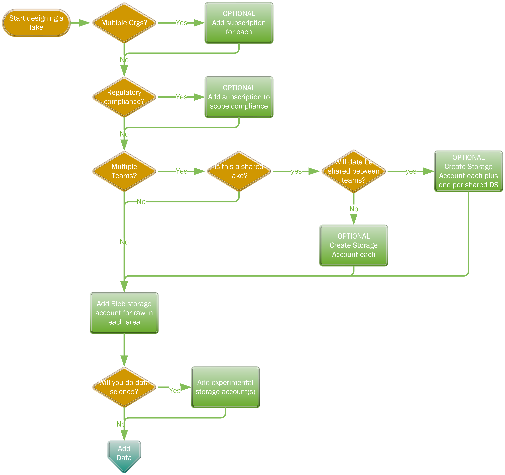

# Data Lake Workshop Questionnaire

** Produced by Dave Lusty **

## 1. Lake Structure

| Question No | Question | Expected Answer | Description |
|:-----------:|----------|-----------------|-------------|
| 1.1 | Do you have multiple business units or companies operating separately? | Yes/No, if yes list them. | If yes, multiple subscriptions are preferred to allow simple separation for M&A activity and for permissioning/compliance |
| 1.2 | Do you have a requirement to be compliant with any regulations? | Yes/No, if yes list them and any relevant sections. | Regulatory compliance may drive separation through subscriptions to focus compliance efforts and clearly show scope. This may rarely also drive regional placement requirements, but check the specific section for confirmation since most regulations do not drive region requirements. |
| 1.3 | Do you have multiple and separate teams who will work on data? | Yes/No | If yes, go to 3a. |
| 1.3a | Will those teams share a data lake? | Yes/No, if yes list the teams that will share the lake. | Sharing a lake is not mandatory, multiple lakes are perfectly acceptable if administration will be separated. This may drive a requirement to segregate data to storage accounts for administrative/permission purposes if multiple teams will be involved. |
| 1.3b | Will any data be shared between teams? | Yes/No| If yes, then storage account permissions can be used and so data placement will follow. |
| 4 | Will you be doing machine learning/data science? | Yes/No | This will require a separate storage account to prevent performance issues/interference |
| 4a | Are there multiple data science teams? | Yes/No, if yes list them | Each team should have a separate storage account with a container per person/experiment |

## 2. Data Sets