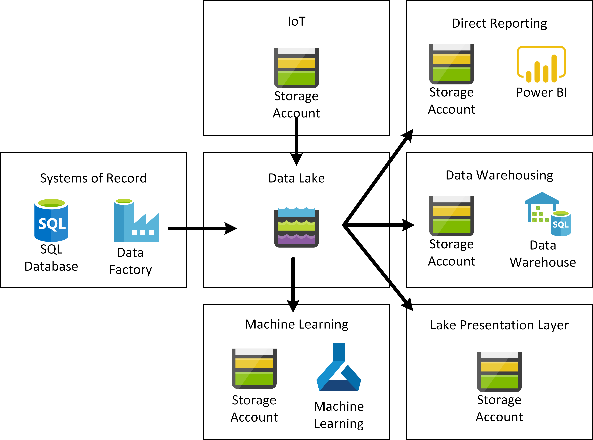
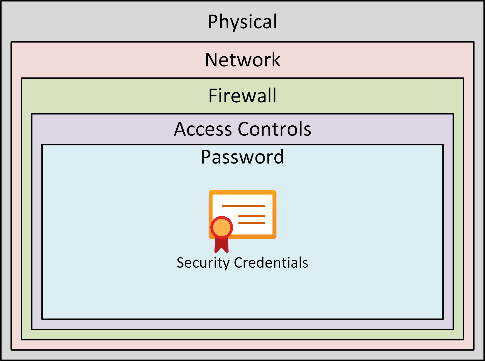
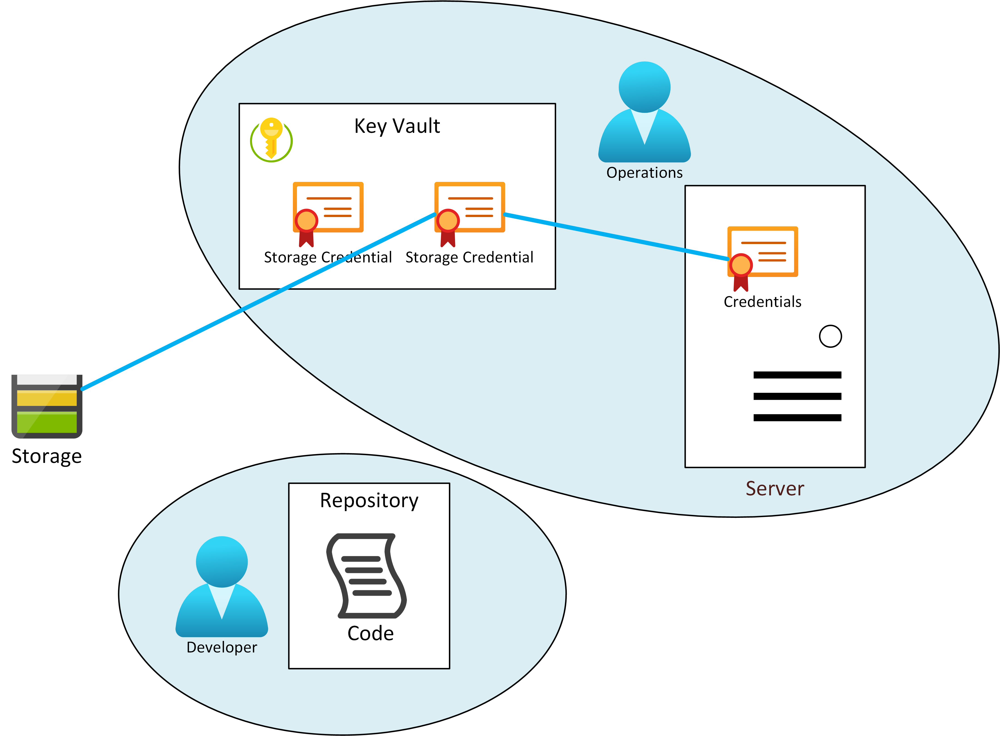

# Security [Draft]

**produced by Dave Lusty**

## Introduction

This document aims to cover some security considerations for cloud data environments. This is not intended as a comprehensive guide but rather as an explainer to several concepts.

## Access Controls

Access controls are an important part of any data storage system. When designing a data platform it is important to remember the different ways systems are used. Systems of record often necessitate individual access and control because people have a one to one relationship with the data in the system. When using a CRM system I am looking at individual records to which I have access because they sit within "my customers", "my area" or "my subsidiary". When data is processed in a data lake, it is generally processed by automation in bulk, and so there is no equivalent relationship on which to base access controls. As a general guiding principal is can be useful to state that humans should have no direct access to data on the lake. If we don't treat the lake as a presentation layer, access control is considerably simpler. Instead, we can focus on presentation layers derived from data housed on the lake. These could be data warehouses, reporting platforms, or analytics platforms. Access controls can then be implemented as suitable for those access layers without opening up the lake itself.

### Who Has Access?

So who does need access directly to the data lake, and how should that access be defined? One traditional approach to access control is to place people into role based access groups, and assign those groups access. While this works well for access to systems of record - where people need access to carry out their role, it doesn't map well to a data lake.
Often in a data lake day to day access is through automation. Data Factory will ingest new data into a data set, and Databricks might take that data set and transform it into a data warehouse model which is then pulled in to Azure Synapse. This kind of access can be managed by giving systems access keys to data sets.
Needless to say, the automation has to be crated before it can run, and that will be done by teams of people. Those people do not need access to the data itself, however, they need access to create an automation and this is different. It is not based on their role, but instead on membership to a project (and role within that project) which is creating some automated data flow or machine learning model. At the conclusion of that project, it is no longer appropriate for the team to retain access to the data itself, if they even required that access during the project at all. This is analogous to how DBAs were often not granted access to the data within their databases on traditional database systems.
This solution works particularly well for projects using a more agile methodology, where a team is assembled to implement something, iterates until that thing is complete and then potentially disbands. Using automation also allows for a clear separation between people and the data. Keys can be stored in a vault, and the automation tooling given access to those keys. The scripting then accesses the keys at runtime, with individual user access controlled either at the key vault or the automation tool with access to the vault. Separate vaults can easily be used to supply keys and connection strings to test or production environments, and swapping the vault quickly allows different environments to be used.

## Types of access

It is useful to define how people and systems might interact with the data lake and the data contained on it before addressing who should get access. There are various actors in a data platform.

### System Access

**Interactive Logon -** this type of access is used generally for compute systems such as Spark clusters. This does not itself give access to data, but the system may have mounted drives with data on them or data stored locally.
**Run Programs or Scripts -** this type of access can be used for further control. If the program/script has good governance around it then it may be given access to data while the person running it does not have that same access. This is often used for automation tooling.

### Data Access

Access to actual data can be granted either through **Access Control Lists (ACLs)** or through **Shared Access Signature (SAS) keys**, or through **Shared Key (storage account key)**. Think of these as most to least specific from left to right. A storage account key grants wide access to the whole account, and is unlikely to be used in many data lake scenarios. It could be used where data access is not tightly controlled, or where data sets are particularly open and accessible, and reduces administration and complexity significantly. SAS keys are similar to granting access to a single folder or file share and are generally used for bulk access for analytics or batch purposes. These are the most appropriate method for automation and analytics workloads and while adding administration overhead they do keep this as light as possible and maintain simplicity at the heart of the lake. Finally, for use cases where fine grained access is required it is possible to use ACLs. These should generally be reserved for presentation layer purposes where fine grained control might be necessary. When using data lake technologies for presentation layer access it is generally good practice to think of this as outside of the data lake from a governance perspective even if the technology is very similar. The diagram below shows some of the various governance and security zones you might have in relation to your data lake. The Systems of Record on the left will likely use ACLs and role based access. The IoT storage will probably use an account key or SAS key as it's a system of record but only for one autonomous system. The central data lake might have SAS keys for various automated processes including analytics and data movement. Machine Learning will often be an experimentation zone where data is copied to be worked on so could have a mix of access types including ACL since it is user facing. The various presentation layers on the right would likely use SAS keys or ACLs depending how the information is presented out. If there is a product such as Synapse or Power Bi they are likely to implement the fine grained access themselves while using a system level key to access data.

<table>
<tr>
<td width="20%">&nbsp;</td>
<td width="60%"></td>
<td width="20%">&nbsp;</td>
</tr>
</table>

**Read Data -** This type of access is often the most controlled, and usually the focus in regulatory compliance. Gaining access to the detail of the data should always come with a reason for that access. Keep in mind that there is no reason for arbitrary and ongoing access to data for a person. The access should always be tied to a job role based requirement or a project based requirement for accessing data if the access is granted to a person. Automation tooling often needs ongoing access to a data set to carry out its task. For these reasons, it is usually the case that data sets in a data lake will be distilled down and modelled before being presented to users, and it is that model which gets read access, not the lake data set.
**Write Data -** this is the only type of access capable of changing or corrupting a data set and should be controlled as tightly as read access. As a general rule, write access to change data is reserved for systems of record, which should not be considered part of your data lake (although might share a technology stack, for instance IoT). Write access for processing and outputting data sets should in most circumstances be reserved for automated and tested processes. Presentation layers in data platforms will not usually include a provision to write data.

## Roles with authorisations on the lake

**Operations -** This access is necessary to set up or configure a data lake solution. This will include creating and removing storage accounts, adding and removing permissions, and changing properties. This does not include access to the data itself since there is no reason operations would interact with the data.

**Data Engineer -** Done properly, data engineering does not require access to data. Arguably you will get better outcomes when data engineering is forced to understand the schema and work to that information. Often data engineers have access to data in order to speed up development, but this can lead to errors or omissions which can later cause problems.

**Data Scientists -** will require access to data, although not necessarily through personal accounts and not necessarily on the lake. This is a broad subject with a lot of factors. When MLOps is being used there is a level of separation between user and data via the code repository and tooling.

## Automated Tooling
If you are using automated deployment then there may well be further separation such that operations teams don't have access to the lake, but instead have access to a key store via an automation tool. In this scenario the operations staff create a deployment file such as a script or template, and then the automation tool accesses the key store at run time to deploy or configure the solution.
A principle rule is that credentials must never be stored in code. Whether that code is committed to a code repository or not, code is too easy to copy and move and so there are no exceptions where credentials should be contained in the code itself if data is to remain secure. In any automation solution, it will not be the user running code, but the system itself. As such that system will be granted access to the key vault, not the user.
Code controls will be used to secure access to these credentials through strong governance. These will include:

 * Only authorised users can commit code to a branch
 * Only (possibly different) authorised users can create a pull request
 * Only (usually different) users can accept a pull request into a build branch of the repository
 * Only authorised users can start a build or release process

Using these controls, access to the data can be made very secure while keeping users at arms length from the data.

## Auditing

Auditing for regulatory compliance can be cumbersome and always includes logging within multiple products as well as access control audits. The absolute best way to audit access to your data lake is to simply show on a data set by data set basis that no people have access, and show which automated systems do, and what they run. 
Auditing access and logs for the key vaults will show when and by what any accesses were made.
Auditing automation systems will show which scripts ran, and when, while logs from the code repository and release system will show what code ran on a specific date.

## System Security

<table>
<tr>
<td width="70%">One of the concepts which is very important to understand is system security. Your laptop or mobile phone is a good example here. You know that your device is secure enough because you know where it is, who has access, and that there is a local security password. Even if you lost your device, it's unlikely to be a problem because the person finding it wouldn't know your password to access it. The same is true of servers in your compute environment. You provision them with known images, you configure them with access controls, add firewall and network controls, and monitor their logs. This makes those servers a trusted place in your environment, and by controlling who can access them, you can control who has access to the contents. </td>
<td width="30%"></td>
</tr>
</table>

Back to your device now, you can log in to cloud services, banks, and other systems within your account. Remembering those logins means that you can use considerably more secure passwords or other access controls than if you had to remember them. Face ID, fingerprint ID or a password/PIN can then be used to verify you before using these passwords, but you only need your system password. Servers can use this same technique for security. The operations team installing the server can implement an ID on the server during initial install, as part of the system imaging, or at some later time. We trust this process because the operations team or script is a known action which itself is controlled. The process is giving the server an ID which it can use to interact with the outside world, but this ID is safe on the server.

## Code Security

Code can be problematic, because it's easy to copy and store. For this reason it is considered bad practice to store passwords within your code. Instead, you should use some kind of password safe such as Azure Key Vault to store the credentials on your behalf. This has multiple benefits. Firstly, the developer/data engineer/data scientist writing code might not personally have access to the thing being protected. They are just writing code which will have access, and it's important to understand the difference. When using Key Vault, the entity running the code will connect to the vault and retrieve credentials at run time. This also means that you can use different vaults for different environments (production vs. test) to access different resources. The entity running the code could be a server as explained in System Security above. This ensures that the credentials to important resources are not stored in code, and that the system gains access when necessary in a secure way. To revoke access we then just need to remove the access key for the system to the Key Vault, or to remove that system entirely.

<table>
<tr>
<td width="50%">This diagram shows the security boundary of the operations team, allowing them access to generate credentials for storage and place them in the Key Vault. Operations do not have access to the storage, however, so they cannot see the data. The developer has a security boundary allowing them access to the code and the code repository. They have no access to the Key Vault or to the storage, although they may in some instances be granted access to a system which does have acess to that storage. The developer would usually deploy using automation such as Azure DevOps, and therefore would not have access to the server (which may also be a cluster or other system, running the code). This is especially true of production environments.</td>
<td width="50%"></td>
</tr>
</table>